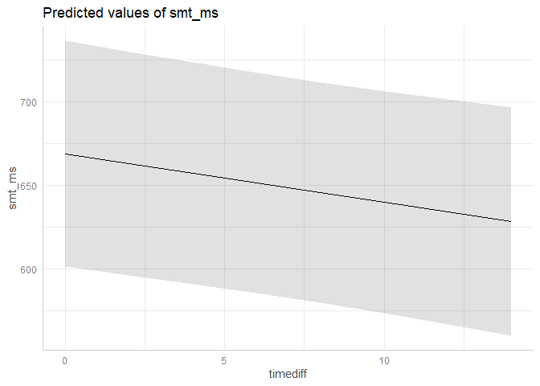

Analysis Script
================
David Hammerschmidt
6/8/2022

This is my analysis for the study [“Spontaneous motor tempo over the
course of a week: The role of the time of the day, chronotype, and
arousal”](https://link.springer.com/article/10.1007/s00426-022-01646-2)
published in *Psychological Research*. The document shows you every step
of the analysis process starting with loading in the data, exploring and
cleaning it, and finally emplowing a multilevel model. Please read the
article for more details on the study design, data collection process
and interpretation of the resutls.

### Importing R packages.

First, import some packages needed throughout the script.

``` r
library(readr)
library(tidyverse)
```

    ## ── Attaching packages ─────────────────────────────────────── tidyverse 1.3.2 ──
    ## ✔ ggplot2 3.3.6     ✔ dplyr   1.0.9
    ## ✔ tibble  3.1.8     ✔ stringr 1.4.0
    ## ✔ tidyr   1.2.0     ✔ forcats 0.5.1
    ## ✔ purrr   0.3.4     
    ## ── Conflicts ────────────────────────────────────────── tidyverse_conflicts() ──
    ## ✖ dplyr::filter() masks stats::filter()
    ## ✖ dplyr::lag()    masks stats::lag()

``` r
library(Hmisc)
```

    ## Lade nötiges Paket: lattice
    ## Lade nötiges Paket: survival
    ## Lade nötiges Paket: Formula
    ## 
    ## Attache Paket: 'Hmisc'
    ## 
    ## Die folgenden Objekte sind maskiert von 'package:dplyr':
    ## 
    ##     src, summarize
    ## 
    ## Die folgenden Objekte sind maskiert von 'package:base':
    ## 
    ##     format.pval, units

``` r
library(lme4)
```

    ## Lade nötiges Paket: Matrix
    ## 
    ## Attache Paket: 'Matrix'
    ## 
    ## Die folgenden Objekte sind maskiert von 'package:tidyr':
    ## 
    ##     expand, pack, unpack

``` r
library(ggeffects)
```

### Downloading the data set and load it into R Studio

Download the data from the Zenodo repository using the zen4R package. It
will be stored in the project folder.

``` r
url <- "https://zenodo.org/record/5947002/smt_esm_data.csv"
destfile <- "C:/Users/DasDavid/Dropbox/Own Stuff/ESM/analysis/markdown/spontaneous_motor_tempo-experience_sampling"
download.file(url, destfile)
```

    ## Warning in download.file(url, destfile): URL https://zenodo.org/record/5947002/
    ## smt_esm_data.csv: Kann Zieldatei 'C:/Users/DasDavid/Dropbox/Own Stuff/ESM/
    ## analysis/markdown/spontaneous_motor_tempo-experience_sampling' nicht öffnen,
    ## Grund 'Permission denied'

    ## Warning in download.file(url, destfile): Download hatte Exit-Status ungleich 0

``` r
master <- read_delim("smt_esm_data.csv", ";", escape_double = FALSE)
```

    ## Rows: 1008 Columns: 48
    ## ── Column specification ────────────────────────────────────────────────────────
    ## Delimiter: ";"
    ## chr (16): userID, gender, chrono_cat, instrument, date, first_prompt, time, ...
    ## dbl (32): order, subj_no, age, chrono_score, gold_msi, education, training, ...
    ## 
    ## ℹ Use `spec()` to retrieve the full column specification for this data.
    ## ℹ Specify the column types or set `show_col_types = FALSE` to quiet this message.

### Data cleaning

We don’t need all the variables (i.e., features) for this analsis, so
let’s select the most important ones and drop NaN values. For a
description of the variables, please have a look at the
“smt_esm_variable_list.txt” file you downloaded with the data set.

``` r
master <- master %>% 
  select(order, subj_no, age, gender, gold_msi, chrono_score, chrono_cat, timediff, day, dayN, 
         emotion_cat, emotion_catN, emotion_intensity, stress_level, paq_total, sss_score,
         smt_ms, smt_cv, tries, activity, company, location) %>% 
  drop_na()
```

Let’s have a first look at the data.

``` r
glimpse(master)
```

    ## Rows: 964
    ## Columns: 22
    ## $ order             <dbl> 1, 2, 3, 4, 5, 6, 7, 8, 9, 10, 12, 13, 14, 15, 16, 1…
    ## $ subj_no           <dbl> 1, 1, 1, 1, 1, 1, 1, 1, 1, 1, 1, 1, 1, 1, 1, 1, 1, 1…
    ## $ age               <dbl> 28, 28, 28, 28, 28, 28, 28, 28, 28, 28, 28, 28, 28, …
    ## $ gender            <chr> "male", "male", "male", "male", "male", "male", "mal…
    ## $ gold_msi          <dbl> 105, 105, 105, 105, 105, 105, 105, 105, 105, 105, 10…
    ## $ chrono_score      <dbl> 48, 48, 48, 48, 48, 48, 48, 48, 48, 48, 48, 48, 48, …
    ## $ chrono_cat        <chr> "neither", "neither", "neither", "neither", "neither…
    ## $ timediff          <dbl> 0.18, 4.55, 8.45, 12.10, 0.63, 5.00, 8.18, 12.70, 0.…
    ## $ day               <chr> "Monday", "Monday", "Monday", "Monday", "Tuesday", "…
    ## $ dayN              <dbl> 0, 0, 0, 0, 1, 1, 1, 1, 2, 2, 2, 3, 3, 3, 3, 4, 4, 4…
    ## $ emotion_cat       <chr> "positive", "positive", "positive", "positive", "pos…
    ## $ emotion_catN      <dbl> 0, 0, 0, 0, 0, 0, 0, 0, 0, 0, 0, 0, 0, 0, 0, 0, 0, 0…
    ## $ emotion_intensity <dbl> 6, 7, 6, 7, 6, 6, 7, 7, 7, 6, 7, 7, 6, 7, 7, 6, 6, 6…
    ## $ stress_level      <dbl> 2, 1, 1, 1, 1, 2, 1, 1, 1, 3, 1, 1, 2, 1, 1, 2, 2, 1…
    ## $ paq_total         <dbl> 11, 24, 12, 8, 10, 7, 7, 24, 15, 7, 7, 15, 7, 24, 11…
    ## $ sss_score         <dbl> 0.41, 0.41, 0.41, 0.41, 0.41, 0.41, 0.41, 0.41, 0.41…
    ## $ smt_ms            <dbl> 610.2439, 585.5238, 595.1905, 501.5510, 499.1600, 73…
    ## $ smt_cv            <dbl> 0.04513896, 0.03017219, 0.04380984, 0.07935801, 0.04…
    ## $ tries             <dbl> 2, 1, 1, 1, 1, 1, 1, 1, 1, 2, 1, 1, 2, 1, 1, 1, 2, 1…
    ## $ activity          <chr> "house work", "relaxation", "work/study", "social in…
    ## $ company           <chr> "nobody, I am alone", "an acquaintance or colleague"…
    ## $ location          <chr> "home", "home", "home", "outdoors", "home", "home", …

Let’s clean this up a bit to make the analysis more efficient.

``` r
master <- master %>% 
  mutate(across(where(is.character),as_factor),
         subj_no = as.factor(subj_no),
         dayN = as.factor(dayN),
         emotion_catN = as.factor(emotion_catN)
         )

summary(master)
```

    ##      order           subj_no         age           gender       gold_msi     
    ##  Min.   :   1.0   2      : 28   Min.   :19.00   male  :399   Min.   : 26.00  
    ##  1st Qu.: 249.8   3      : 28   1st Qu.:26.00   female:565   1st Qu.: 56.00  
    ##  Median : 502.5   7      : 28   Median :29.00                Median : 72.00  
    ##  Mean   : 502.6   8      : 28   Mean   :28.71                Mean   : 71.01  
    ##  3rd Qu.: 754.2   12     : 28   3rd Qu.:33.00                3rd Qu.: 91.00  
    ##  Max.   :1008.0   13     : 28   Max.   :40.00                Max.   :115.00  
    ##                   (Other):796                                                
    ##   chrono_score     chrono_cat     timediff             day      dayN   
    ##  Min.   :28.00   neither:535   Min.   :-0.030   Monday   :135   0:135  
    ##  1st Qu.:42.00   morning:189   1st Qu.: 3.580   Tuesday  :142   1:142  
    ##  Median :48.50   evening:240   Median : 7.380   Wednesday:137   2:137  
    ##  Mean   :48.44                 Mean   : 6.415   Thursday :141   3:141  
    ##  3rd Qu.:57.00                 3rd Qu.:11.470   Friday   :137   4:137  
    ##  Max.   :68.00                 Max.   :14.170   Saturday :136   5:136  
    ##                                                 Sunday   :136   6:136  
    ##    emotion_cat  emotion_catN emotion_intensity  stress_level     paq_total    
    ##  positive:726   0:726        Min.   :1.000     Min.   :1.000   Min.   : 7.00  
    ##  negative:238   1:238        1st Qu.:4.000     1st Qu.:1.000   1st Qu.: 8.00  
    ##                              Median :5.000     Median :2.000   Median :12.00  
    ##                              Mean   :4.814     Mean   :2.322   Mean   :13.67  
    ##                              3rd Qu.:6.000     3rd Qu.:3.000   3rd Qu.:17.25  
    ##                              Max.   :7.000     Max.   :7.000   Max.   :43.00  
    ##                                                                               
    ##    sss_score         smt_ms           smt_cv            tries     
    ##  Min.   :0.140   Min.   : 180.7   Min.   :0.02448   Min.   :1.00  
    ##  1st Qu.:0.360   1st Qu.: 495.2   1st Qu.:0.05760   1st Qu.:1.00  
    ##  Median :0.430   Median : 621.3   Median :0.07699   Median :1.00  
    ##  Mean   :0.426   Mean   : 655.7   Mean   :0.09903   Mean   :1.07  
    ##  3rd Qu.:0.500   3rd Qu.: 794.2   3rd Qu.:0.12260   3rd Qu.:1.00  
    ##  Max.   :0.660   Max.   :2701.1   Max.   :0.29997   Max.   :6.00  
    ##                                                                   
    ##                activity                               company   
    ##  work/study        :204   nobody, I am alone              :431  
    ##  relaxation        :200   an acquaintance or colleague    : 84  
    ##  social interaction:127   several friends or acquaintances: 50  
    ##  watching TV/movie :112   a large crowd                   : 26  
    ##  having a meal     : 74   partner or friend               :221  
    ##  travel            : 74   one or more strangers           : 49  
    ##  (Other)           :173   my family                       :103  
    ##                    location  
    ##  home                  :593  
    ##  work/university/school:119  
    ##  outdoors              : 83  
    ##  transport             : 77  
    ##  another person's home : 59  
    ##  shop                  : 10  
    ##  (Other)               : 23

The summary shows negative values for “timediff” which means one or more
tests were done before the first prompt of a day. Let’s remove these
values.

``` r
master <- master %>%
  filter(timediff >= 0) 
```

Getting a first look at the spontaneous motor tempi (var = smt_ms).

``` r
ggplot(master, aes(x=timediff, y=smt_ms)) + 
  geom_point() +
  labs(x="Time of the day\n(hours from first prompt)", y="SMT (ms)")
```

<!-- -->

``` r
ggplot(master, aes(x=smt_ms)) + 
  geom_histogram(aes(y = ..density..), binwidth=25) + 
  geom_density() +
  geom_vline(aes(xintercept=mean(smt_ms)), color="red") +
  geom_vline(aes(xintercept=median(smt_ms)),color="blue") +
  labs(x="SMT (ms)", y="Frequency")
```

<!-- -->

There seem to be outliers, so let’s detect and remove them.

### Outlier detection

Here, outliers are detected for each participant seperately, thus the
data is split into 36 sets and the detection process is carried out the
same amount of time. In order to detect the outliers, a custom function
is used.

``` r
is_outlier <- function(x) {
  return(x < quantile(x, 0.25) - 1.5 * IQR(x) | x > quantile(x, 0.75) + 1.5 * IQR(x))
}

master %>%
  mutate(outlier = ifelse(is_outlier(smt_ms), smt_ms, as.numeric(NA))) %>%
  ggplot(., aes(x = subj_no, y = smt_ms)) +
  geom_boxplot() +
  geom_text(aes(label = outlier), na.rm = TRUE, hjust = -0.3)
```

<!-- -->

### Removing outliers

For removing outliers, an IQR of 1.5 is used.

``` r
remove_outliers <- function(x, na.rm = TRUE, ...) {
  qnt <- quantile(x, probs=c(.25, .75), na.rm = na.rm, ...)
  H <- 1.5 * IQR(x, na.rm = na.rm)
  y <- x
  y[x < (qnt[1] - H)] <- NA
  y[x > (qnt[2] + H)] <- NA
  y
}

master <- master %>%
  group_by(subj_no) %>%
  mutate(smt_ms = remove_outliers(smt_ms)) %>%
  ungroup() %>% 
  drop_na()
```

Let’s have a look at the cleaned data for each participant.

``` r
ggplot(master, aes(x = timediff, y = smt_ms, group = subj_no)) +
  coord_cartesian() +
  geom_point() +
  geom_smooth(method = "lm", aes(colour = subj_no)) +
  facet_wrap(~subj_no, ncol=6) +
  xlab("Time from first prompt") + ylab("SMT (ms)") +
  theme(legend.position = "none")
```

    ## `geom_smooth()` using formula 'y ~ x'

<!-- -->

### Relationship of fixed factors

Let’s have a look at the relationship between some factors since some
variables measured closely related things, e.g. emotional intensitiy,
stress level, and physiological arousal. In order to do so, we need to
average the level-1 variables before the can compute a correlation
matrix.

``` r
sum_stats <- plyr::ddply(master, c("subj_no", "gold_msi", "chrono_score"), summarise,
                         emo_int_mean = mean(emotion_intensity, na.rm = T),
                         stress_lvl_mean = mean(stress_level, na.rm = T),
                         paq_total_mean = mean(paq_total, na.rm = T))

sum_stats %>%
  select(emo_int_mean, paq_total_mean, stress_lvl_mean, chrono_score, gold_msi) %>% 
  as.matrix() %>% 
  rcorr(type = c("pearson"))
```

    ##                 emo_int_mean paq_total_mean stress_lvl_mean chrono_score
    ## emo_int_mean            1.00           0.17            0.08         0.04
    ## paq_total_mean          0.17           1.00            0.67        -0.07
    ## stress_lvl_mean         0.08           0.67            1.00        -0.01
    ## chrono_score            0.04          -0.07           -0.01         1.00
    ## gold_msi                0.19           0.23            0.04        -0.19
    ##                 gold_msi
    ## emo_int_mean        0.19
    ## paq_total_mean      0.23
    ## stress_lvl_mean     0.04
    ## chrono_score       -0.19
    ## gold_msi            1.00
    ## 
    ## n= 36 
    ## 
    ## 
    ## P
    ##                 emo_int_mean paq_total_mean stress_lvl_mean chrono_score
    ## emo_int_mean                 0.3362         0.6280          0.8169      
    ## paq_total_mean  0.3362                      0.0000          0.6647      
    ## stress_lvl_mean 0.6280       0.0000                         0.9559      
    ## chrono_score    0.8169       0.6647         0.9559                      
    ## gold_msi        0.2797       0.1682         0.8249          0.2739      
    ##                 gold_msi
    ## emo_int_mean    0.2797  
    ## paq_total_mean  0.1682  
    ## stress_lvl_mean 0.8249  
    ## chrono_score    0.2739  
    ## gold_msi

Here we can see that the stress level (stress_lvl_mean) and
physiological arousal (paq_totol_mean) are correlated (*r* = .67, *p* \<
.001). Since physiological arousal increases with stress, I decided to
only use the PAQ score.

### Centering fixed factors

Before a multilevel model can be employed, the variables need to be
centered. The within-participants (level-1) variables (assessed with
each test) are centered-within-clusters (cwc approach) and
between-participant variables (level-2, assessed before the test period)
are grand-mean-centered (gmc approach) since 0 is not a meaningful value
for some of these inventories.

``` r
master <- master %>% 
  group_by(subj_no) %>% 
  mutate(
    emo_int_mean = mean(emotion_intensity, na.rm = T),
    paq_total_mean = mean(paq_total, na.rm = T),
  ) %>% ungroup() %>%
  mutate(
    chrono_gmc = scale(chrono_score, center = T, scale = F),
    gold_msi_gmc = scale(gold_msi, center = T, scale = F),
    emotion_int_cwc = emotion_intensity - emo_int_mean,
    paq_total_cwc = paq_total - paq_total_mean,
  )
```

### Multilevel model

Now the model can be build.

#### Unconditional model

First step is the unconditional model.

``` r
m.0 <- lmer(smt_ms ~ 1
            + (1|subj_no),
            data = master,
            REML = FALSE)
summary(m.0)
```

    ## Linear mixed model fit by maximum likelihood  ['lmerMod']
    ## Formula: smt_ms ~ 1 + (1 | subj_no)
    ##    Data: master
    ## 
    ##      AIC      BIC   logLik deviance df.resid 
    ##  12378.7  12393.2  -6186.3  12372.7      943 
    ## 
    ## Scaled residuals: 
    ##     Min      1Q  Median      3Q     Max 
    ## -5.1370 -0.5300 -0.0704  0.5044  5.1410 
    ## 
    ## Random effects:
    ##  Groups   Name        Variance Std.Dev.
    ##  subj_no  (Intercept) 39825    199.6   
    ##  Residual             24271    155.8   
    ## Number of obs: 946, groups:  subj_no, 36
    ## 
    ## Fixed effects:
    ##             Estimate Std. Error t value
    ## (Intercept)   650.17      33.65   19.32

#### Fixed factors

Now the fixed factors will be added to the model.

``` r
m.1 <- lmer(smt_ms ~ timediff 
            + paq_total_cwc
            + gold_msi_gmc
            + chrono_gmc
            + (1|subj_no),
            data = master,
            REML = FALSE)
summary(m.1)
```

    ## Linear mixed model fit by maximum likelihood  ['lmerMod']
    ## Formula: smt_ms ~ timediff + paq_total_cwc + gold_msi_gmc + chrono_gmc +  
    ##     (1 | subj_no)
    ##    Data: master
    ## 
    ##      AIC      BIC   logLik deviance df.resid 
    ##  12368.3  12402.3  -6177.2  12354.3      939 
    ## 
    ## Scaled residuals: 
    ##     Min      1Q  Median      3Q     Max 
    ## -5.0868 -0.5324 -0.0658  0.5344  5.2183 
    ## 
    ## Random effects:
    ##  Groups   Name        Variance Std.Dev.
    ##  subj_no  (Intercept) 39788    199.5   
    ##  Residual             23788    154.2   
    ## Number of obs: 946, groups:  subj_no, 36
    ## 
    ## Fixed effects:
    ##               Estimate Std. Error t value
    ## (Intercept)   668.3719    34.4212  19.417
    ## timediff       -2.8483     1.1457  -2.486
    ## paq_total_cwc  -3.7117     1.0272  -3.613
    ## gold_msi_gmc    0.4231     1.4518   0.291
    ## chrono_gmc      0.4340     3.2979   0.132
    ## 
    ## Correlation of Fixed Effects:
    ##             (Intr) timdff pq_tt_ gld_m_
    ## timediff    -0.214                     
    ## paq_ttl_cwc -0.010  0.048              
    ## gold_ms_gmc -0.006  0.003  0.000       
    ## chrono_gmc  -0.013  0.003  0.000  0.187

Let’s check if model performance improved.

``` r
anova(m.0, m.1)
```

    ## Data: master
    ## Models:
    ## m.0: smt_ms ~ 1 + (1 | subj_no)
    ## m.1: smt_ms ~ timediff + paq_total_cwc + gold_msi_gmc + chrono_gmc + (1 | subj_no)
    ##     npar   AIC   BIC  logLik deviance  Chisq Df Pr(>Chisq)   
    ## m.0    3 12379 12393 -6186.3    12373                        
    ## m.1    7 12368 12402 -6177.2    12354 18.323  4   0.001067 **
    ## ---
    ## Signif. codes:  0 '***' 0.001 '**' 0.01 '*' 0.05 '.' 0.1 ' ' 1

Yes, it did! Next step is to look for important interaction between
fixed factors. In order to avoid overfitting the model, only two-way
interactions are considered.

``` r
m.2 <- lmer(smt_ms ~ timediff*gold_msi_gmc
                + timediff*paq_total_cwc
                + timediff*chrono_gmc
                + gold_msi_gmc*paq_total_cwc
                + chrono_gmc*gold_msi_gmc 
                + paq_total_cwc*chrono_gmc
                + (1|subj_no),
                data = master,
                REML = FALSE)

anova(m.2)
```

    ## Analysis of Variance Table
    ##                            npar Sum Sq Mean Sq F value
    ## timediff                      1 127515  127515  5.4010
    ## gold_msi_gmc                  1   1750    1750  0.0741
    ## paq_total_cwc                 1 310584  310584 13.1550
    ## chrono_gmc                    1    410     410  0.0174
    ## timediff:gold_msi_gmc         1  30595   30595  1.2959
    ## timediff:paq_total_cwc        1   4691    4691  0.1987
    ## timediff:chrono_gmc           1 121779  121779  5.1581
    ## gold_msi_gmc:paq_total_cwc    1   2220    2220  0.0940
    ## gold_msi_gmc:chrono_gmc       1   2424    2424  0.1027
    ## paq_total_cwc:chrono_gmc      1   2698    2698  0.1143

The interaction between time of the day and chronotype score has a high
F-value (timediff:chrono_gmc), so this interaction should be added to
model and checked if the model performance improves.

``` r
m.3 <- lmer(smt_ms ~ gold_msi_gmc 
            + paq_total_cwc 
            + timediff*chrono_gmc
            + (1|subj_no),
            data = master,
            REML = FALSE)

anova(m.1, m.2, m.3)
```

    ## Data: master
    ## Models:
    ## m.1: smt_ms ~ timediff + paq_total_cwc + gold_msi_gmc + chrono_gmc + (1 | subj_no)
    ## m.3: smt_ms ~ gold_msi_gmc + paq_total_cwc + timediff * chrono_gmc + (1 | subj_no)
    ## m.2: smt_ms ~ timediff * gold_msi_gmc + timediff * paq_total_cwc + timediff * chrono_gmc + gold_msi_gmc * paq_total_cwc + chrono_gmc * gold_msi_gmc + paq_total_cwc * chrono_gmc + (1 | subj_no)
    ##     npar   AIC   BIC  logLik deviance  Chisq Df Pr(>Chisq)  
    ## m.1    7 12368 12402 -6177.2    12354                       
    ## m.3    8 12366 12405 -6175.2    12350 4.0438  1    0.04433 *
    ## m.2   13 12373 12436 -6173.7    12347 2.8938  5    0.71635  
    ## ---
    ## Signif. codes:  0 '***' 0.001 '**' 0.01 '*' 0.05 '.' 0.1 ' ' 1

Adding this interaction improved the model whereas adding all possible
interactions did not.

#### Model prediction

Now let us look at the final model and the predications.

``` r
summary(m.3)
```

    ## Linear mixed model fit by maximum likelihood  ['lmerMod']
    ## Formula: smt_ms ~ gold_msi_gmc + paq_total_cwc + timediff * chrono_gmc +  
    ##     (1 | subj_no)
    ##    Data: master
    ## 
    ##      AIC      BIC   logLik deviance df.resid 
    ##  12366.3  12405.1  -6175.2  12350.3      938 
    ## 
    ## Scaled residuals: 
    ##     Min      1Q  Median      3Q     Max 
    ## -5.2047 -0.5272 -0.0443  0.5285  5.1979 
    ## 
    ## Random effects:
    ##  Groups   Name        Variance Std.Dev.
    ##  subj_no  (Intercept) 39746    199.4   
    ##  Residual             23684    153.9   
    ## Number of obs: 946, groups:  subj_no, 36
    ## 
    ## Fixed effects:
    ##                     Estimate Std. Error t value
    ## (Intercept)         668.8036    34.3996  19.442
    ## gold_msi_gmc          0.4282     1.4510   0.295
    ## paq_total_cwc        -3.6488     1.0255  -3.558
    ## timediff             -2.8875     1.1433  -2.526
    ## chrono_gmc           -0.9753     3.3695  -0.289
    ## timediff:chrono_gmc   0.2218     0.1102   2.013
    ## 
    ## Correlation of Fixed Effects:
    ##             (Intr) gld_m_ pq_tt_ timdff chrn_g
    ## gold_ms_gmc -0.006                            
    ## paq_ttl_cwc -0.010  0.000                     
    ## timediff    -0.213  0.003  0.048              
    ## chrono_gmc  -0.014  0.183 -0.006  0.007       
    ## tmdff:chrn_  0.006  0.002  0.031 -0.017 -0.208

``` r
pred_time <- ggpredict(m.3, terms = "timediff") 
pred_int <- ggpredict(m.3, terms = c("timediff","chrono_gmc"))
pred_paq <- ggpredict(m.3, terms = "paq_total_cwc")
pred_msi <- ggpredict(m.3, terms = "gold_msi_gmc")

plot(pred_time)
```

<!-- -->

``` r
plot(pred_int) +
  scale_colour_brewer(palette = "Set1", labels = c("-1 SD (evening type)", "Mean (neither)", "+1 SD (morning type)"))
```

    ## Scale for 'colour' is already present. Adding another scale for 'colour',
    ## which will replace the existing scale.

<!-- -->

``` r
plot(pred_paq)
```

<!-- -->

``` r
plot(pred_msi)
```

<!-- -->
